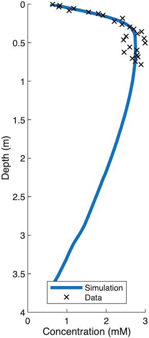
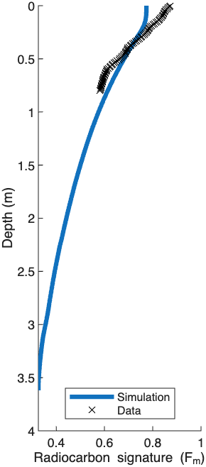
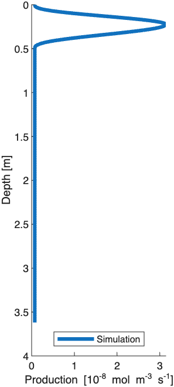
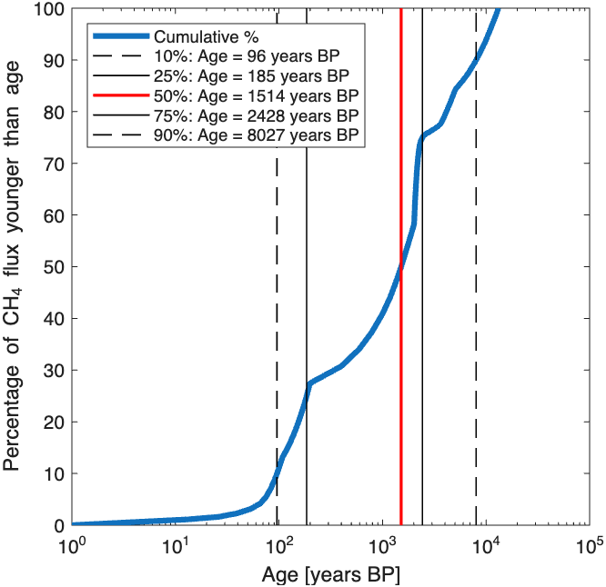

# Age-Structured Methane Diagenetic Model (minimal working example)

This repository contains a minimal MATLAB implementation of an **age-structured diagenetic model for dissolved methane (CH4)** in lake sediments. The code decomposes methane into radiocarbon age classes, solves a steady-state 1D transport problem for each class, and fits a parameterized methane production profile to concentration and Fm observations.

In this public example, the **Darcy flux is prescribed** and the remaining production-profile parameters are optimized.

## Repository layout

- `demo.m` — main script; reproduces the included example results
- `src/` — helper functions used by the model and inverse solver
- `data/data.xlsx` — input data used by the demo
- `results/` — figures and spreadsheet produced by the demo

## Model summary

The model solves the steady-state conservative transport equation for dissolved methane,

$$
-\frac{dJ_{\mathrm{tot}}}{dz} = P_{\mathrm{CH_4}}(z),
\qquad
J_{\mathrm{tot}}(z) = -\phi(z) D_{\mathrm{eff}}(z) \frac{dC}{dz} + q C(z),
$$

where $q$ is a prescribed Darcy flux, $\phi$ is porosity, and $D_eff$ is the effective diffusion coefficient. Because the transport operator is linear in concentration, methane is decomposed into age classes and the total concentration is obtained by summation. The inverse step fits a smooth production profile to observed CH4 concentrations and Fm values.

## Requirements

- MATLAB
- Optimization Toolbox (`patternsearch`, `lsqnonlin`)

## Quick start

From the repository root, run:

```matlab
 demo
```

The script will:

1. read the input data from `data/data.xlsx`,
2. solve the transport model,
3. optimize the methane production profile,
4. regenerate the figures and spreadsheet in `results/`, and
5. print key model diagnostics to the MATLAB command window.

## Included output

The repository includes the output currently produced by the demo script:

- `results/concentration-profile.png`
- `results/mean-radiocarbon-age.png`
- `results/production-shape.png`
- `results/flux-age-distribution.png`
- `results/flux-age-distribution.xlsx`

## Figures

### Concentration, radiocarbon signature, and production profiles
<p align="center">
  
  
  
</p>

### Cumulative flux age distribution


## Citation

If you use this code, please cite the accompanying paper:

> M. Bulínová, A. Rouillard, K. Larsson, X. Xu, J. Walker, C. Olid, J. Rydberg, C. Gudasz, S. E. Kjellman, G. Panieri, C. I. Czimczik, A. Schomacker (2026). *The ancient carbon elevator: Quantifying legacy effect on methane emissions by northern lakes*. Submitted manuscript. DOI: TBD

A machine-readable citation file is also included as `CITATION.cff`.

## License

This repository is released under the **MIT License**. That allows broad reuse, including modification and redistribution. As is standard in scientific software, we additionally request that users cite the accompanying paper when this code contributes to published work.

## Notes

- The demo is intended as a **minimal working example**, not a full research workflow.
- The fixed Darcy flux and included dataset correspond to the numerical example presented in the paper, albeit using uncalibrated ages.
- The output in `results/` is version-controlled intentionally so that users can compare their own run with the expected example output.
